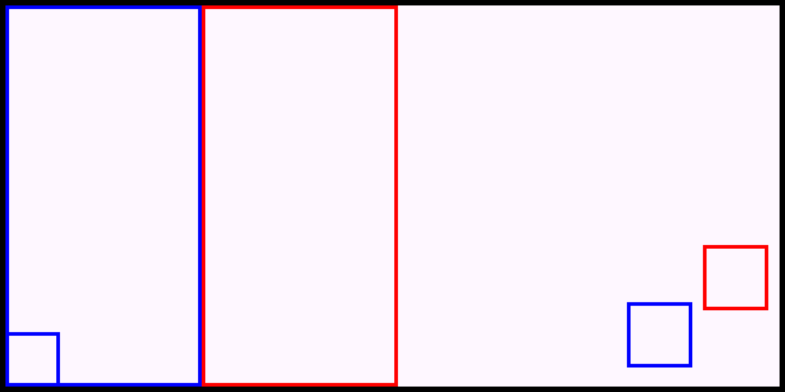

Remember: This was developed with dimensions of a Pixel 3a XL 34 phone

The whole plan for the game: Make a game wherein two players battle it out with their own chickens

To do:
- [x] Make a conversion ratio for the dimensions on GandorView
- [x] Let set padding from the root layout be the config to place the view starting position
- [x] Set main world and development
- [x] Make separate thread for game loop
- [x] Make gravity
- [x] Make controller class
- [x] Fix scaling
- [x] Readjust jumping button
- [x] Refactor scaling to having another object do it instead
- [x] Attach player one to controller
- [x] Refactor player one in way that it doesn't get buggy when set to the controller, or you know test it out first, if its fine then just got ahead with it
- [x] Make a new layer for the controls
- [x] Add left and right control on the left side of screen
- [x] Add Buttons for attack on right hand side
- [x] Add Button for jump on right hand side
- [x] Add states enum
- [x] Add jumping mechanism on jump
- [x] Fix Jumping mechanism bug, in JumpButton
- [x] Refine jumping action to scale
- [x] Refine gravity
- [x] Refactor current state to be more than one
- [x] Refine jumping while stopping moving
- [x] Refine acceleration scaling to be more intuitive to handle
- [x] Add moving right logic
- [x] Refine moving right
- [x] Fix on MotionEvent.ActionMove bug, it accelerates the object on dragging
- [x] Add moving left logic
- [x] Attach moving right and left controls
- [x] Refine jumping, make it jump faster
- [x] Refine moving left and right to change direction on drag
- [x] Fix decceleration bug
- [ ] Add logic for collision
- [ ] Limit characters within the borders of the screen
- [ ] Add logic for attack collision
- [ ] Add life bars
- [ ] Add menu for one player game or two players
- [ ] Develop AI kontra
- [ ] Add capability to connect via wifi
- [ ] Add capability for two phones to connect to a player
- [ ] Add capability for player 2 to use second chicken

Current look:
